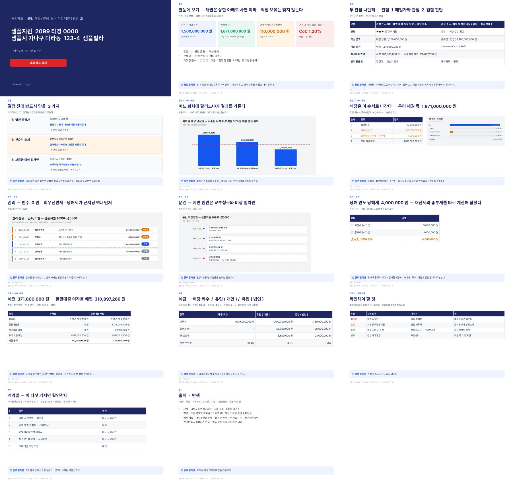

# npl-deck-standard — 물건카드 PPTX 표준 스킬

NPL 채권 매입·경매 직접 낙찰 분석 결과를 **같은 모양·같은 순서**의 PPTX로 만드는 Claude 스킬입니다.

- 16:9 · 맑은 고딕
- 장마다 제목 = 결론 한 문장
- 하단 「한 줄로 말하면」
- KPI 카드 4장
- 표 8행 이하



## 들어 있는 것

| 파일 | 쓰임 |
|---|---|
| `SKILL.md` | 스킬 본문 — 규격 · 장 구성 · 검산 · 완료 전 검사 |
| `templates/card_template.js` | PPTX 생성기 견본(pptxgenjs). 헬퍼는 그대로 두고 장 내용만 바꾼다 |
| `templates/charts_template.py` | 도표 4종: 권리 사다리 · 문건 타임라인 · 배당 폭포 · 회차 시나리오 |
| `templates/sample_model.json` | **가상 데이터** 견본 모델 |
| `examples/견본_물건카드_가상데이터.pptx` | 견본 모델로 만든 14장 덱 |

모든 사건번호·주소·기관명은 **가상**입니다. 실제 물건이 아닙니다.

## 설치 (Claude)

이 폴더를 zip으로 묶어 Claude 설정 → 기능(Capabilities) → 스킬에 업로드합니다.
zip 안의 맨 위 폴더가 `npl-deck-standard`이고, 그 안에 `SKILL.md`가 있어야 합니다.

## 직접 실행

```bash
pip install cairosvg
npm i -g pptxgenjs
cd templates
python charts_template.py sample_model.json
node card_template.js sample_model.json
```

Windows PowerShell에서는 `node`를 실행하기 전에 `$env:NODE_PATH=(npm root -g)`를 먼저 실행합니다.

## 면책

이 자료는 덱 양식입니다. 투자 권유나 법률·세무 자문이 아닙니다.
